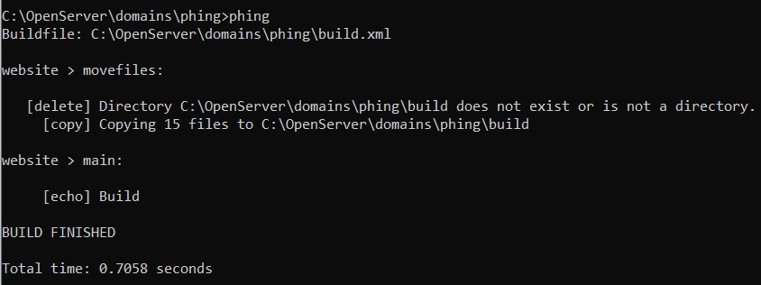
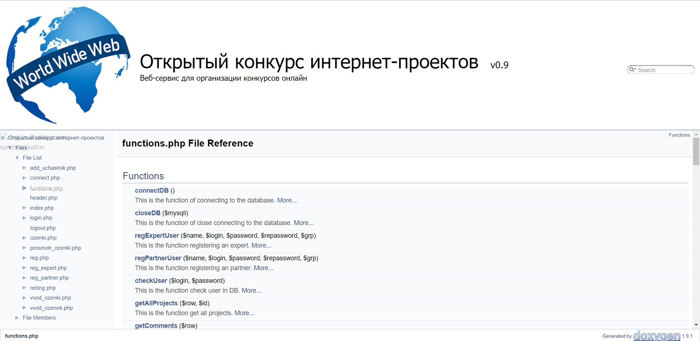

# Открытый конкурс интернет-проектов

Это веб-приложение для организации конкурса
Интернет-проектов.

## В чём суть?

Участники конкурса регистрируются на сайте, вводя своё имя и пароль учётной записи, или входят в уже существующи аккаунт.

После регистрации они размещают на сайте сведения о конкурсных работах: наименование работы и её краткое описание.
Эксперты регистрируются на сайте так же, как и участники конкурса.

После регистрации эксперты могут оценить работы участников, выставить
оценку по пятибалльной системе и оставить короткий комментарий - отзыв о работе.

## Основные функции
Используя описание структуры базы данных, а также шаблоны отдельных страниц, наша команда реализовала на сайте:
+ Базу данных для хранения сведений об участниках, экспертах, конкурсных работах и полученных оценках с определёнными условиями:
  + один участник может представить неограниченное количество работ;
  + одну работу могут оценить неограниченное количество раз;
  + один эксперт может выставить неограниченное количество оценок.
+ Функцию регистрации пользователей:
  + Пользователь выбирает одну из ролей:
      1) Участник;
      2) Эксперт.
  + Пользователь вводит своё имя (логин) и пароль.
+ Функцию авторизации (входа в существующую учётную запись) пользователей с отображением соответствующего контента на главной странице:
  + Для авторизованного пользователя, не выбравшего роль;
  + Для эксперта;
  + Для участника.
+ Функция добавления работ на проверку;
+ Функция просмотра рейтинга участников конкурса;
+ Функция просмотра сведений о работах участников (имя работы, автор работы, описание работы) на главной странице для всех типов пользователей (как и авторизированных, так и не авторизированных).

## Истории пользователей

### Организатор конкурса
Я, как организатор конкурса, хочу иметь веб-сервис для проведения онлайн конкурсов.
Как пользователь этого веб-сервиса, я хочу иметь доступ к просмотру последних работ и к рейтингу участников. 

Как пользователь, я хочу регистроваться или входить в свою учётную запись на сайте, чтобы потом продолжить работу как участник или
эксперт.

### Участник конкурса
Как участник конкурса, я хочу иметь возможность загружать свои работы, не только для участия в конкурсе проектов, но и для просмотра оценок и комментариев экспертов. В дальнейшем хочу иметь доступ к своим работам и всей информации об этих работах (комментарии экспертов и их оценки).

После регистрации, мне нужно иметь доступ к оценкам и
комментариям экспертов к своим работам, чтобы знать, где были допущенные мною ошибки, и не повторять их.

### Эксперт, проверяющий работы
Как эксперт, я хочу иметь доступ к работам участников, для их проверки и оценки.
Также, я хотел бы оставлять краткие комментарии - отзыв о работе, чтобы обосновать выставленную мной оценку.

## Как запустить наш проект
1. Скачать бесплатный базовый пакет программы OpenServer версии 5.2.2(!)
2. Выставить в настройках OpenServer следующие версии модулей:
   - Apache 2.4
   - PHP 5.6
   - MySQL 5.5
3. Склонировать этот репозиторий в папку на веб-сервере (в эту папку Вы установили OpenServer, по умолчанию это папка  ```C:\OpenServer\domains\<имя_склонированного_репозитория>```).
4. Зайти в ```phpMyAdmin``` и импортировать файл ```ib_db.sql``` в новую таблицу с идентичным названием.
5. Запустить OpenServer и удостовериться в работоспособности.

## Запуск сборщика пакета Phing
1. Установить composer:
   1. Cоздать в корневой директории файл ```composer.json```.
   2. Добавить туда следующий код:
		```
		{
			"require-dev": {
					"phing/phing": "2.*"
				}
		}
		```
   3. Зайти в консоль OpenServer (Дополнительно->Консоль)
   4. Установить Composer командой: ```curl -s https://getcomposer.org/installer | php```
2. Установить зависимости командой ```php composer.phar install```
3. Добавьте файл по адресу ```C:\OpenServer\domains\phing\vendor\phing\phing\bin\phing.bat``` в переменные среды вашей ОС для удобного запуска сборщика проектов Phing.
4. Запустить сборку проектов можно из командой строки вашей ОС, для этого перейдите в корневую папку с проектов на веб-сервере (у меня это ```C:\OpenServer\domains\phing```) и введите команду ```phing```. После этого начнётся сборка проекта.
Завершённый процесс сборки показан на рисунке ниже:


## Генерация документации
Генерация документация производится с помощью Doxygen GUI frontend.

Для того чтобы сгенерировать документацию скачайте и установите [Doxygen](https://www.doxygen.nl/download.html), откройте наш Doxyfile через меню file->open. После, на вкладке Run нажмите Run Doxygen. Запустится генерация документации, после нажмите Show HTML output.

